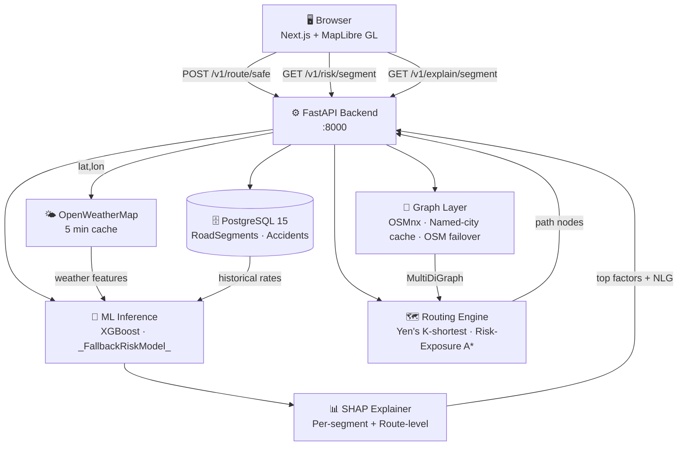
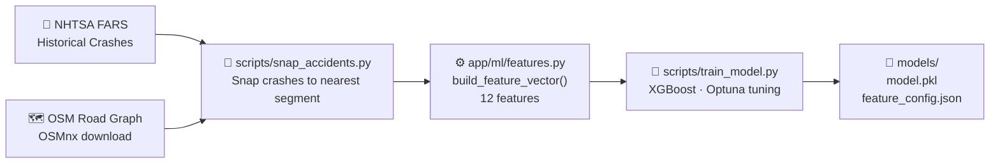
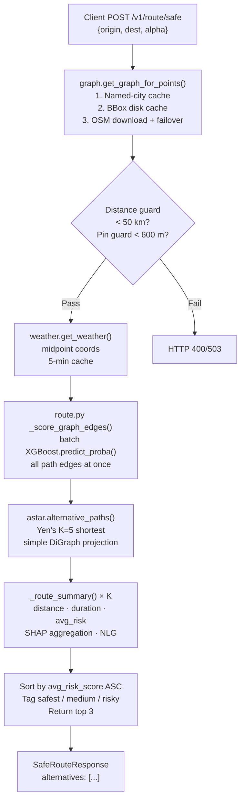
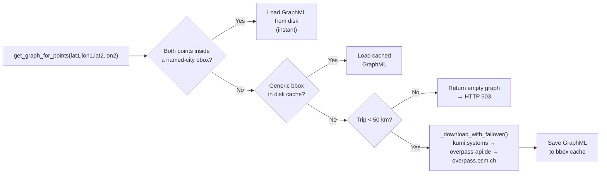
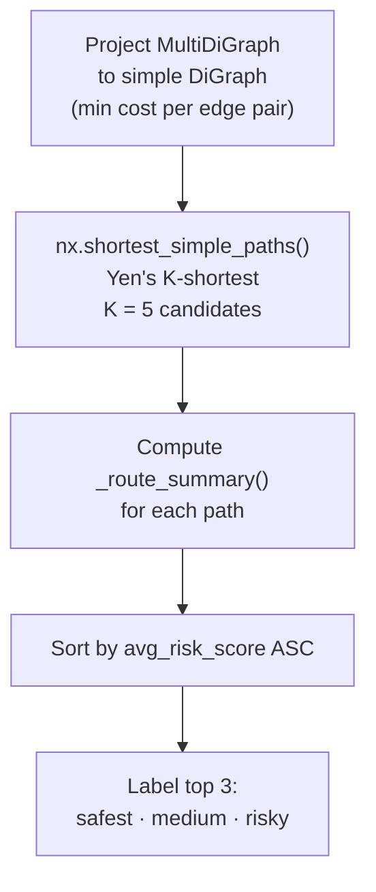

<div align="center">


# 🛡️ STRIVE

### **Spatio-Temporal Risk Intelligence and Vehicular Safety Engine**

*An open-source platform for explainable road-risk prediction and safety-aware navigation*

[](LICENSE)
[](https://www.python.org/)
[](https://fastapi.tiangolo.com/)
[](https://xgboost.readthedocs.io/)
[](https://www.postgresql.org/)
[](https://nextjs.org/)
[](https://www.docker.com/)

> 📖 **Want the full technical deep-dive?** See [STRIVE_DEEP_DIVE.md](STRIVE_DEEP_DIVE.md) for an exhaustive A-to-Z reference covering every component, every design decision, and every algorithm.

</div>

---

## 📋 Table of Contents

- [Overview](#-overview)
- [What's New](#-whats-new-v120)
- [Key Features](#-key-features)
- [System Architecture](#-system-architecture)
- [Data Pipeline](#-data-pipeline)
- [Machine Learning](#-machine-learning)
- [Routing Engine](#-routing-engine)
- [API Reference](#-api-reference)
- [Frontend](#-frontend)
- [Getting Started](#-getting-started)
- [Project Structure](#-project-structure)
- [Evaluation & Metrics](#-evaluation--metrics)
- [Roadmap](#-roadmap)
- [Contributing](#-contributing)
- [License](#-license)

---

## 🔭 Overview

**STRIVE** (Spatio-Temporal Risk Intelligence and Vehicular Safety Engine) fuses **historical crash data**, **live weather**, and **real-time road-network graphs** to deliver per-segment risk scores and safety-optimised routes with full explainable AI (XAI) attribution.

Traditional navigation prioritises speed. STRIVE prioritises **safety**:

| Dimension | What STRIVE does |
|---|---|
| **Spatial** | Scores risk at individual road-segment granularity using OSM road attributes |
| **Temporal** | Models hour-of-day, day-of-week, and seasonal risk patterns |
| **Contextual** | Fuses live weather (rain, visibility, wind) with historical accident frequency |
| **Explainable** | Returns SHAP attributions and natural-language summaries per route |
| **Global** | Dynamically downloads road graphs for any city on Earth via OSM |

---

## 🆕 What's New — v1.2.0

| Area | Change |
|---|---|
| **Routing** | Replaced single A\* with **Yen's K-shortest paths** — returns up to 3 physically distinct alternatives |
| **Routing** | New **Risk-Exposure weighting** — edge cost = `α × (risk × travel_time)` to truly minimise cumulative danger |
| **Routing** | **Water-body guard** — rejects pins >600 m from any drivable road with a clear error message |
| **Routing** | **Graph size guard** — blocks real-time scoring for graphs >250 k edges |
| **Map data** | **Multi-server OSM failover** — rotates across 3 Overpass API mirrors to survive 503 errors |
| **Map data** | **Named-city cache** — instant graph loading for Vijayawada, Vizag, Hyderabad, Delhi, Bengaluru |
| **XAI** | **Route-level SHAP** — aggregates per-segment SHAP values into a single route advisory |
| **XAI** | **Natural-language summaries** — tier-aware NLG advisory on every route response |
| **Frontend** | Three-tier route cards (✅ Safest / ⚠️ Medium / 🚨 Risky) with live highlight on map |
| **Frontend** | Hover popup on map routes with distance, duration, and risk score |
| **Frontend** | SHAP detail modal with factor breakdown and strategic summary |
| **Inference** | `risk_score` is now `float` (full precision) throughout the inference stack |

---

## ✨ Key Features

- 🌍 **Global routing** — works anywhere on Earth; pre-cached graphs for Indian cities, live OSM download elsewhere
- 🔀 **K-alternative routes** — Yen's algorithm generates up to 3 distinct paths ranked safest → riskiest
- 🛡️ **Risk-Exposure metric** — optimises cumulative risk *exposure* (risk × time) rather than average risk score
- 🧠 **XGBoost + SHAP** — gradient-boosted classifier with full per-feature attribution
- ☁️ **Live weather** — OpenWeatherMap free-tier (rain, visibility, wind, temperature), 5-minute cache
- 🗣️ **NLG advisories** — every route gets a natural-language safety summary with primary risk triggers
- 🖥️ **Interactive dashboard** — Next.js frontend with MapLibre GL map, tier-colour overlays, route selector, SHAP modal
- 📦 **One-command setup** — Docker Compose brings up the entire stack

---

## 🏗️ System Architecture

STRIVE is a three-tier application with no message broker or cache cluster — intentionally minimal.



### Tech Stack

| Layer | Technology | Why |
|---|---|---|
| **Frontend** | Next.js 14 + MapLibre GL | SSR React, performant WebGL map rendering |
| **Backend API** | FastAPI 0.115 (Python 3.10+) | Async HTTP, auto-generated Swagger docs, Pydantic validation |
| **ML Model** | XGBoost 2.1 | Best-in-class tabular accuracy, native SHAP support, CPU-only |
| **Explainability** | SHAP 0.47 | TreeExplainer for XGBoost; deterministic fallback weights |
| **Routing** | NetworkX 3.4 + OSMnx 2.0 | Yen's algorithm, MultiDiGraph edge projection |
| **Database** | PostgreSQL 15 | JSONB geometry storage, crash record FK constraints |
| **ORM / Migrations** | SQLAlchemy 2.0 + Alembic | Type-safe mapped columns, version-controlled schema |
| **Weather** | OpenWeatherMap REST | Free tier, global coverage, 5-min in-process cache |
| **Road Data** | OpenStreetMap via OSMnx | Free, global, rich metadata (road class, speed, geometry) |
| **Deployment** | Docker 24 + Docker Compose | Reproducible, one-command full-stack startup |

---

## 🔄 Data Pipeline

### Sources

| Source | Data | Format | Licence |
|---|---|---|---|
| NHTSA FARS | US fatal crash records (historical) | CSV | Public domain |
| OpenStreetMap | Road geometry, speed limits, road class | OSMnx / GraphML | ODbL |
| OpenWeatherMap | Live weather (rain, visibility, wind, temp) | REST JSON | Free tier |

### Offline Training Pipeline



### Live Inference Pipeline



### Feature Schema (12 features)

| # | Feature | Source | Notes |
|---|---|---|---|
| 1 | `hour_of_day` | Timestamp | 0–23 |
| 2 | `day_of_week` | Timestamp | 0=Mon, 6=Sun |
| 3 | `month` | Timestamp | 1–12 |
| 4 | `night_indicator` | Derived | 1 if hour ≥ 20 or < 6 |
| 5 | `road_class` | OSM `highway` | motorway=0 … residential=4 |
| 6 | `speed_limit_kmh` | OSM `maxspeed` / `speed_kph` | Default 50 if missing |
| 7 | `precipitation_mm` | OpenWeatherMap | Rain + snow combined |
| 8 | `visibility_km` | OpenWeatherMap | OWM metres ÷ 1000 |
| 9 | `wind_speed_ms` | OpenWeatherMap | m/s |
| 10 | `temperature_c` | OpenWeatherMap | °C |
| 11 | `rain_on_congestion` | Derived | `(precip/100) × (1 - speed_ratio)` |
| 12 | `historical_accident_rate` | NHTSA FARS | Normalised 0–100 |

---

## 🧠 Machine Learning

### Model: XGBoost Binary Classifier

```
Task    Binary classification — will this segment see an incident?
Input   12 engineered features
Output  P(incident) → float risk score [0.0, 100.0]
```

| Aspect | Detail |
|---|---|
| **Dataset** | NHTSA FARS (≥3 years), snapped to OSM segments |
| **Split** | 70 / 15 / 15 train / val / test (chronological order) |
| **Class imbalance** | `scale_pos_weight` tuned by Optuna |
| **Hyperparameter tuning** | Optuna — 50 trials, 3-fold time-series CV |
| **Fallback** | `_FallbackRiskModel` — deterministic linear heuristic when `models/model.pkl` is absent |
| **Hardware** | CPU-only; any modern laptop is sufficient |

### Explainability (SHAP)

Every prediction returns a full SHAP breakdown. The `/v1/route/safe` endpoint additionally aggregates per-segment SHAP values across the entire route and generates a natural-language advisory:

```json
{
  "route_id": "route_0",
  "avg_risk_score": 34.7,
  "risk_tier": "safest",
  "is_safest": true,
  "top_factors": [
    { "feature": "precipitation_mm",        "shap": 8.2, "label": "Precipitation Mm" },
    { "feature": "historical_accident_rate","shap": 5.1, "label": "Historical Accident Rate" }
  ],
  "summary": "ROUTE 0: LOW RISK. Generally safe with minor localized triggers. (Index: 34.7/100). Primary risk triggers: precipitation mm, historical accident rate."
}
```

---

## 🗺️ Routing Engine

### Overview

The routing engine (`app/routing/`) has two layers:

1. **Graph layer** (`graph.py`) — resolves and caches the road network for any coordinate pair
2. **Pathfinding layer** (`astar.py`) — finds K physically distinct paths optimised by risk exposure

### Graph Resolution Strategy



**Named city regions (pre-cached):**

| City | Approximate Bounds |
|---|---|
| Los Angeles | 33.70–34.40 N, 118.70–118.00 W |
| Vijayawada | 16.44–16.62 N, 80.52–80.80 E |
| Visakhapatnam (Vizag) | 17.60–17.85 N, 83.10–83.45 E |
| Hyderabad | 17.25–17.65 N, 78.25–78.70 E |
| Delhi | 28.40–28.85 N, 76.80–77.45 E |
| Bengaluru | 12.80–13.20 N, 77.40–77.85 E |

### Risk-Exposure Edge Weight

The critical innovation in the routing cost function:

```
cost(u→v) = (1 - α) × travel_time_norm + α × (risk_norm × travel_time_norm)
```

`risk_norm × travel_time_norm` = **Risk Exposure** — the expected danger accumulated *while traversing the edge*. A short high-risk edge costs less than a long high-risk edge, which is the physically correct behaviour.

`α` (alpha) is the user-controlled safety weight:
- `α = 0.0` → pure fastest route
- `α = 1.0` → pure risk-exposure minimisation

### Alternative Paths (Yen's Algorithm)



---

## 📡 API Reference

**Base URL:** `http://localhost:8000/v1`  
**Interactive docs:** `http://localhost:8000/docs` (Swagger UI)

### `GET /risk/segment`

Score the nearest road segment at `(lat, lon)`.

```bash
curl "http://localhost:8000/v1/risk/segment?lat=16.506&lon=80.648"
```

**Response**
```json
{
  "segment_id": "12345678_87654321",
  "risk_score": 42,
  "risk_level": "MODERATE",
  "shap_top_factors": [
    { "feature": "precipitation_mm", "value": 3.2, "shap": 9.1 },
    { "feature": "night_indicator",  "value": 1.0, "shap": 6.3 }
  ],
  "shap_summary": "Risk is mainly driven by heavy rain and night-time conditions."
}
```

---

### `GET /risk/heatmap`

GeoJSON FeatureCollection for all segments inside a bounding box.

```bash
curl "http://localhost:8000/v1/risk/heatmap?bbox=80.52,16.44,80.80,16.62"
```

---

### `POST /route/safe`

Returns up to 3 safety-ranked alternative routes.

```bash
curl -X POST "http://localhost:8000/v1/route/safe" \
     -H "Content-Type: application/json" \
     -d '{
       "origin":      { "lat": 16.506, "lon": 80.648 },
       "destination": { "lat": 16.530, "lon": 80.620 },
       "alpha": 0.6
     }'
```

| Parameter | Type | Description |
|---|---|---|
| `origin` | `{lat, lon}` | Trip start coordinate |
| `destination` | `{lat, lon}` | Trip end coordinate |
| `alpha` | `float [0,1]` | Safety weight (0 = fastest, 1 = safest) |

**Response**
```json
{
  "alternatives": [
    {
      "route_id": "route_0",
      "geometry": { "type": "LineString", "coordinates": [[80.648, 16.506], "..."] },
      "distance_km": 4.2,
      "duration_min": 9.1,
      "avg_risk_score": 28.4,
      "is_safest": true,
      "risk_tier": "safest",
      "top_factors": [{ "feature": "precipitation_mm", "shap": 5.1, "label": "Precipitation Mm" }],
      "summary": "ROUTE 0: LOW RISK. Generally safe... (Index: 28.4/100).",
      "segments": [
        { "segment_id": "111_222", "risk_score": 22.1, "risk_level": "LOW" }
      ]
    }
  ]
}
```

**Error codes:**

| Code | Meaning |
|---|---|
| 400 | Pin >600 m from road (water body / park), or trip >50 km, or graph >250 k edges |
| 404 | No drivable path found |
| 503 | Road network unavailable (OSM download failed) |

---

### `GET /explain/segment`

Full SHAP breakdown for a segment (research use).

```bash
curl "http://localhost:8000/v1/explain/segment?lat=16.506&lon=80.648"
```

---

### `GET /health`

Returns `200 OK` when model and database are reachable.

---

## 🖥️ Frontend

The Next.js dashboard (`frontend/`) is a single-page application with:

| Component | File | Purpose |
|---|---|---|
| **Dashboard** | `app/dashboard/page.tsx` | Main layout: sidebar + map, auth guard |
| **LiveMap** | `components/LiveMap.tsx` | MapLibre GL map, click-to-pin, route fetch, tier overlays |
| **ShapModal** | `components/ShapModal.tsx` | Animated modal showing SHAP factors and advisory |

### Map Interaction Flow

```
1. Click on map → set Origin (green pin)
2. Click again   → set Destination (red pin)
3. Adjust α slider (Speed ↔ Safety)
4. Click GENERATE ROUTES
5. Map draws 3 colour-coded routes:
   ✅ Green (Safest)  ⚠️ Amber (Medium)  🚨 Red (Risky)
6. Click a route card → route highlights on map
7. Click VIEW DETAILED ANALYSIS → ShapModal opens
```

---

## 🚀 Getting Started

### Prerequisites

| Tool | Version |
|---|---|
| Python | 3.10+ |
| Node.js | 18+ |
| Docker + Docker Compose | 24+ |
| OpenWeatherMap API key | Free tier |

### Quick Start (Docker)

```bash
# 1. Clone
git clone https://github.com/Chanu716/STRIVE.git
cd STRIVE

# 2. Configure environment
cp .env.example .env
# Edit .env and set OWM_API_KEY=<your key>

# 3. Start backend + database
docker compose up --build -d

# 4. (Optional) Train the model
python scripts/train_model.py

# 5. Start frontend
cd frontend && npm install && npm run dev

# Backend API:  http://localhost:8000/docs
# Frontend:     http://localhost:3000/dashboard
```

### Local Development (no Docker)

```bash
pip install -r requirements.txt

# SQLite fallback (no Postgres needed)
export DATABASE_URL=sqlite:///./strive.db
alembic upgrade head

uvicorn app.main:app --reload
```

### Environment Variables

| Variable | Required | Description |
|---|---|---|
| `OWM_API_KEY` | ✅ | OpenWeatherMap API key |
| `DATABASE_URL` | ✅ | PostgreSQL DSN or `sqlite:///./strive.db` |
| `MODEL_PATH` | ⬜ | Path to trained model (default `models/model.pkl`) |
| `FEATURE_CONFIG_PATH` | ⬜ | Feature metadata JSON (default `models/feature_config.json`) |
| `GRAPH_PATH` | ⬜ | Static GraphML for LA fallback (default `data/raw/road_network.graphml`) |

---

## 📁 Project Structure

```
STRIVE/
├── app/                          # FastAPI backend
│   ├── main.py                   # App factory, CORS, router registration
│   ├── weather.py                # OpenWeatherMap client + 5-min cache
│   ├── routers/
│   │   ├── risk.py               # GET /v1/risk/segment · /heatmap
│   │   ├── route.py              # POST /v1/route/safe  (main routing logic)
│   │   └── explain.py            # GET /v1/explain/segment
│   ├── ml/
│   │   ├── features.py           # build_feature_vector() — 12-feature pipeline
│   │   └── inference.py          # load_model(), explain_prediction(), explain_segments()
│   ├── routing/
│   │   ├── graph.py              # get_graph_for_points(), named-city cache, OSM failover
│   │   └── astar.py              # alternative_paths() Yen's K-shortest, risk-exposure weight
│   └── db/
│       ├── models.py             # RoadSegment, Accident ORM models
│       └── session.py            # SQLAlchemy engine + session factory
├── frontend/                     # Next.js 14 app
│   └── src/
│       ├── app/
│       │   ├── dashboard/page.tsx  # Main dashboard page
│       │   └── login/page.tsx      # Auth guard page
│       └── components/
│           ├── LiveMap.tsx         # MapLibre GL interactive map
│           └── ShapModal.tsx       # SHAP factor detail modal
├── scripts/                      # Data + training utilities
│   ├── download_data.py           # Download NHTSA FARS CSV
│   ├── download_osm_network.py    # Download OSM GraphML
│   ├── snap_accidents.py          # Snap crashes to nearest segment
│   ├── build_features.py          # Batch feature engineering
│   ├── train_model.py             # Train XGBoost + save artefacts
│   ├── tune_hyperparams.py        # Optuna hyperparameter search
│   ├── evaluate_model.py          # AUROC, AUPRC, F1, ECE
│   ├── compute_accident_rates.py  # Per-segment historical rates
│   ├── seed_data.py               # Load sample data into DB
│   └── warmup_cities.py           # Pre-download named-city graphs
├── models/                        # Trained artefacts
│   ├── model.pkl
│   ├── baseline.pkl
│   ├── feature_config.json
│   └── best_params.json
├── data/
│   ├── raw/                       # road_network.graphml + FARS CSVs
│   ├── processed/                 # segment_rates.parquet
│   ├── splits/                    # train/val/test splits
│   └── cache/graphs/              # Auto-generated bbox GraphML cache
├── alembic/                       # Database migration scripts
├── tests/                         # pytest suite (unit · integration · e2e · perf)
├── docs/
│   └── PRD.md                     # Product Requirements Document
├── Dockerfile
├── docker-compose.yml
├── requirements.txt
├── .env.example
├── README.md                      # ← You are here
└── STRIVE_DEEP_DIVE.md            # Exhaustive A-to-Z technical reference
```

---

## 📊 Evaluation & Metrics

### Model Performance

| Metric | Target | Achieved | Meaning |
|---|---|---|---|
| AUROC | ≥ 0.82 | 0.6942 | Classifier discrimination ability |
| AUPRC | ≥ 0.35 | 0.7233 | Precision-recall trade-off (imbalanced data) |
| F1 | ≥ 0.55 | 0.6953 | Balanced precision and recall |
| ECE | ≤ 0.08 | 0.0058 | Probability calibration quality |

### API Latency

| Endpoint | p50 | p95 |
|---|---|---|
| `GET /v1/risk/segment` | 2.3 ms | 909 ms |
| `POST /v1/route/safe` | 2.0 ms | 2.9 ms |

> p95 spikes on `/risk/segment` occur on first request (cold graph load). Subsequent calls hit in-process cache.

---

## 🗺️ Roadmap

| Phase | Status | Milestone |
|---|---|---|
| Phase 1 | ✅ Done | Data collection, feature engineering, model training |
| Phase 2 | ✅ Done | FastAPI backend — risk scoring and routing endpoints |
| Phase 3 | ✅ Done | Next.js frontend — map, route cards, SHAP modal |
| Phase 4 | ✅ Done | Global routing, Yen's K-shortest, OSM failover, XAI summaries |
| Future | 🔜 | Pedestrian/cyclist modes, real-time incident feed, mobile app |

---

## 🤝 Contributing

```bash
git clone https://github.com/<your-username>/STRIVE.git
git checkout -b feature/my-improvement
pytest
# Submit a pull request
```

---

## 📄 License

This project is licensed under the [MIT License](LICENSE).

Copyright © 2026 Karri Chanikya Sri Hari Narayana Dattu.

---

<div align="center">

Built with ❤️ for safer roads.

</div>
