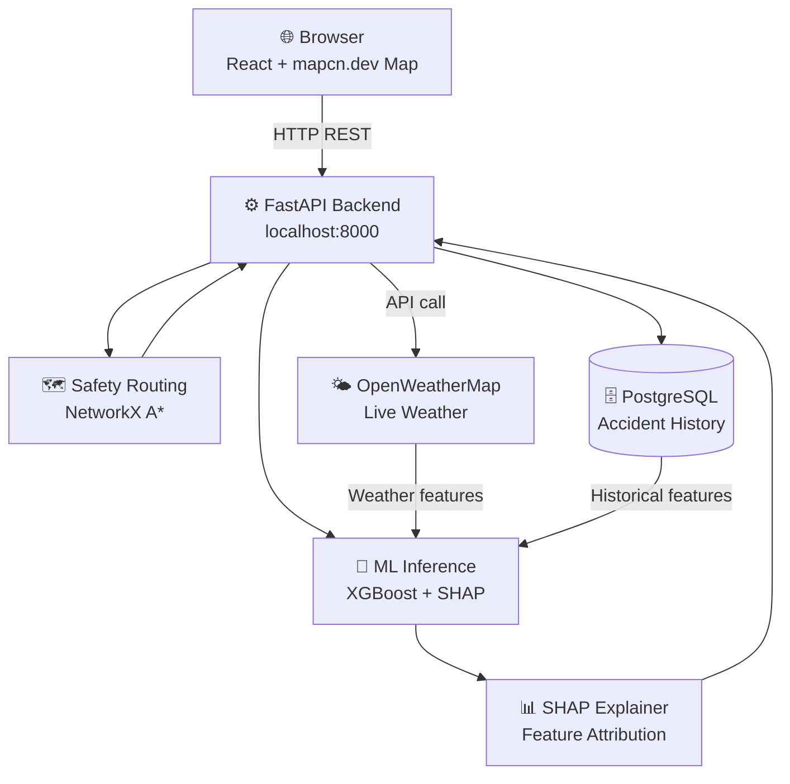
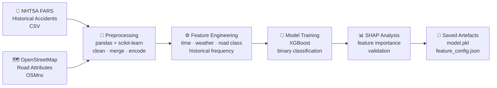
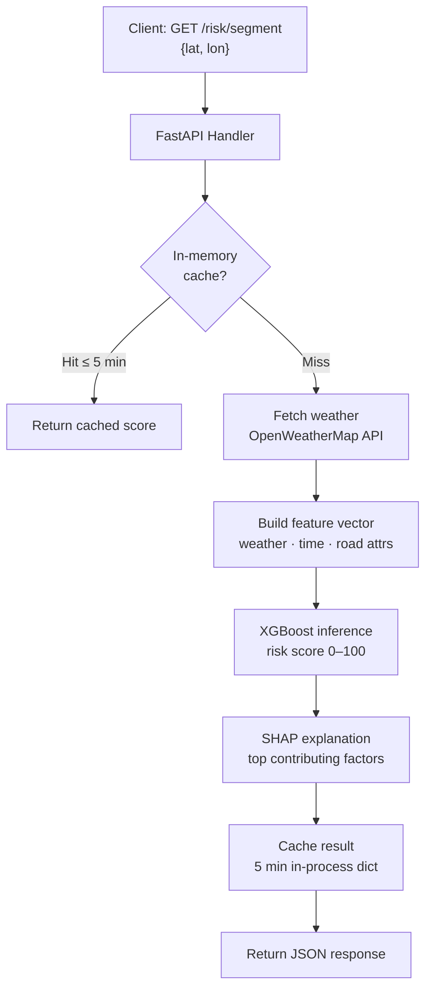

<div align="center">


# 🛡️ STRIVE

### **Spatio-Temporal Risk Intelligence and Vehicular Safety Engine**

*A research prototype for explainable road-risk prediction and safety-aware routing*

[](LICENSE)
[](https://www.python.org/)
[](https://fastapi.tiangolo.com/)
[](https://scikit-learn.org/)
[](https://www.postgresql.org/)
[](https://react.dev/)
[](https://mapcn.dev/)
[](https://www.docker.com/)

</div>

---

## 📋 Table of Contents

- [Overview](#-overview)
- [Key Features](#-key-features)
- [System Architecture](#-system-architecture)
- [Data Pipeline](#-data-pipeline)
- [Machine Learning Approach](#-machine-learning-approach)
- [API Reference](#-api-reference)
- [Getting Started](#-getting-started)
- [Project Structure](#-project-structure)
- [Evaluation & Metrics](#-evaluation--metrics)
- [Roadmap](#-roadmap)
- [Contributing](#-contributing)
- [License](#-license)

---


## 🔭 Overview

**STRIVE** (Spatio-Temporal Risk Intelligence and Vehicular Safety Engine) is a research prototype that fuses **historical crash data**, **live weather**, and **road-network context** to deliver per-segment risk scores and safety-optimised routes with explainable AI insights.

Traditional navigation prioritises speed and distance. STRIVE prioritises **safety** by:

| Dimension | What STRIVE does |
|---|---|
| **Spatial** | Scores risk at individual road-segment granularity using OSM road attributes |
| **Temporal** | Models time-of-day, day-of-week, and seasonal risk patterns |
| **Contextual** | Fuses live weather (rain, visibility, wind) with historical accident frequency |
| **Explainable** | Returns SHAP factor attributions so users understand *why* a segment is risky |

> **Research goal:** demonstrate that a small team can build a meaningful safety-prediction system using open data and standard ML tools — no proprietary infrastructure required.

---

## ✨ Key Features

- 🗺️ **Risk scoring** — every road segment scored 0–100, updated on request with fresh weather data
- 🔀 **Safety-aware routing** — A\* routing with a tunable risk / travel-time trade-off parameter *α*
- 🧠 **Gradient-boosted ML model** — XGBoost trained on historical accident records + engineered features
- ☁️ **Live weather integration** — OpenWeatherMap free-tier API (rain, visibility, temperature, wind)
- 🔍 **Explainable AI** — SHAP values and natural-language summaries for every prediction
- 🗺️ **Interactive map** — React frontend powered by mapcn.dev with colour-coded risk heatmap and route overlay
- 📦 **Single-command setup** — Docker Compose brings up the full stack in one step

---

## 🏗️ System Architecture

STRIVE uses a minimal three-tier architecture: a React frontend using mapcn.dev, a single FastAPI backend, and a PostgreSQL database. There is no message broker, no caching cluster, and no separate microservices.



### Tech Stack

| Layer | Technology | Purpose |
|---|---|---|
| **Frontend** | React + mapcn.dev | Interactive risk heatmap and route display |
| **Backend API** | FastAPI (Python) | REST endpoints, ML inference, routing |
| **ML Model** | XGBoost + scikit-learn | Accident risk classification |
| **Explainability** | SHAP | Per-feature risk attribution |
| **Routing** | NetworkX + OSMnx | Graph construction, A\* pathfinding |
| **Database** | PostgreSQL 15 | Historical accident and road-segment data |
| **Weather** | OpenWeatherMap API | Live precipitation, visibility, temperature |
| **Road Data** | OpenStreetMap (OSMnx) | Road geometry, speed limits, road class |
| **Deployment** | Docker + Docker Compose | One-command local and production setup |

---

## 🔄 Data Pipeline

### Sources

| Source | Data | Format | Licence |
|---|---|---|---|
| NHTSA FARS | US fatal crash records (historical) | CSV | Public domain |
| OpenStreetMap | Road geometry, speed limits, road class | OSMnx / PBF | ODbL |
| OpenWeatherMap | Live weather (rain, visibility, wind, temp) | REST JSON | Free tier |

### Training Pipeline



### Inference Pipeline



### Feature Schema

| Feature | Type | Source |
|---|---|---|
| `hour_of_day` | int | Timestamp |
| `day_of_week` | int | Timestamp |
| `month` | int | Timestamp |
| `precipitation_mm` | float | OpenWeatherMap |
| `visibility_km` | float | OpenWeatherMap |
| `wind_speed_ms` | float | OpenWeatherMap |
| `temperature_c` | float | OpenWeatherMap |
| `road_class` | int | OSM |
| `speed_limit_kmh` | int | OSM |
| `historical_accident_rate` | float | NHTSA FARS |
| `night_indicator` | bool | Derived |
| `rain_on_congestion` | float | Derived |

---

## 🧠 Machine Learning Approach

### Model

STRIVE trains an **XGBoost binary classifier** to predict whether a road segment will experience an incident in a given time window. XGBoost was chosen for its strong performance on tabular data, fast CPU inference, and native SHAP compatibility.

```
Task:    Binary classification — incident / no incident
Input:   12 engineered features (weather + time + road attributes)
Output:  P(incident) → scaled to risk score [0, 100]
```

### Training

| Aspect | Detail |
|---|---|
| **Dataset** | NHTSA FARS (3+ years), matched to OSM road segments |
| **Split** | 70 / 15 / 15 train / val / test (chronological) |
| **Class imbalance** | `scale_pos_weight` in XGBoost |
| **Hyperparameter tuning** | Optuna (50 trials, 3-fold time-series CV) |
| **Hardware** | Runs on any laptop CPU — no GPU required |

### Evaluation Targets

| Metric | Target |
|---|---|
| AUROC | ≥ 0.82 |
| AUPRC | ≥ 0.35 |
| F1 @ threshold | ≥ 0.55 |
| Inference latency | ≤ 50 ms per segment (CPU) |

### Explainability

Every risk score includes a SHAP explanation:

```json
{
  "segment_id": "way/123456789",
  "risk_score": 74,
  "risk_level": "HIGH",
  "top_factors": [
    { "feature": "precipitation_mm",       "shap": 18.4, "label": "Heavy rain" },
    { "feature": "historical_accident_rate","shap": 12.1, "label": "High-risk location" },
    { "feature": "night_indicator",        "shap":  6.3, "label": "Night-time driving" },
    { "feature": "visibility_km",          "shap":  4.2, "label": "Reduced visibility" }
  ],
  "summary": "HIGH RISK. Heavy rain on a historically dangerous segment at night."
}
```

---

## 📡 API Reference

Base URL: `http://localhost:8000/v1`

Interactive docs available at `http://localhost:8000/docs` (Swagger UI).

### `GET /risk/segment`

Returns the risk score for a road segment given coordinates.

**Query params:** `lat`, `lon`

**Example `curl`**:
```bash
curl "http://localhost:8000/v1/risk/segment?lat=34.05&lon=-118.24"
```

**Response**
```json
{
  "segment_id": "way/123456789",
  "risk_score": 74,
  "risk_level": "HIGH",
  "updated_at": "2026-04-13T18:30:00Z",
  "top_factors": [
    { "feature": "precipitation_mm", "shap": 18.4, "label": "Heavy rain" }
  ],
  "summary": "HIGH RISK. Heavy rain on a historically dangerous segment."
}
```

---

### `GET /risk/heatmap`

Returns a GeoJSON FeatureCollection of road segments with risk scores for map rendering.

**Query params:** `bbox` (`min_lon,min_lat,max_lon,max_lat`)

**Example `curl`**:
```bash
curl "http://localhost:8000/v1/risk/heatmap?bbox=34.0,-118.3,34.1,-118.2"
```

---

### `POST /route/safe`

Returns a safety-optimised route between two coordinates.

**Example `curl`**:
```bash
curl -X POST "http://localhost:8000/v1/route/safe" \
     -H "Content-Type: application/json" \
     -d '{"origin": {"lat": 34.052, "lon": -118.243}, "destination": {"lat": 34.073, "lon": -118.200}, "alpha": 0.6}'
```

**Request body**
```json
{
  "origin":      { "lat": 37.7749, "lon": -122.4194 },
  "destination": { "lat": 37.8044, "lon": -122.2712 },
  "alpha": 0.6
}
```

> `alpha` ∈ [0, 1]: weight given to **safety** vs **speed**.
> `alpha=1.0` → pure safety routing. `alpha=0.0` → pure fastest route.

**Response**
```json
{
  "route_id": "rte_abc123",
  "geometry": { "type": "LineString", "coordinates": [[...]] },
  "distance_km": 8.4,
  "duration_min": 18,
  "overall_risk_score": 31,
  "vs_fastest_route": {
    "extra_distance_km": 1.2,
    "extra_time_min": 3,
    "risk_reduction_pct": 38
  },
  "segments": [
    { "segment_id": "way/111", "risk_score": 18, "risk_level": "LOW", "distance_km": 1.1 }
  ]
}
```

---

### `GET /explain/segment`

Returns the full SHAP explanation for a road segment.

**Query params:** `lat`, `lon`

**Example `curl`**:
```bash
curl "http://localhost:8000/v1/explain/segment?lat=34.05&lon=-118.24"
```

---

### `GET /health`

Health check — returns `200 OK` when the service is running.

---

## 🚀 Getting Started

### Prerequisites

| Tool | Version |
|---|---|
| Python | 3.10+ |
| Docker + Docker Compose | 24+ |
| OpenWeatherMap API key | Free tier |

### Quick Start

```bash
# 1. Clone the repository
git clone https://github.com/Chanu716/STRIVE.git
cd STRIVE

# 2. Add your API key
cp .env.example .env   # fill in OPENWEATHERMAP_API_KEY

# 3. Download data and train model
python scripts/download_data.py --city "Los Angeles, CA" --years 2021 2022
python scripts/train_model.py --skip-tuning

# 4. Start all services
docker compose up --build -d

# 5. Load sample accident data
python scripts/seed_data.py

# API available at http://localhost:8000/docs
```

> **Frontend Note:** A React + mapcn.dev interactive map frontend is available at `/map` after startup (maintained separately; see the `frontend/` directory).

### Local Development (no Docker)

```bash
# Install dependencies
pip install -r requirements.txt

# Start PostgreSQL (or use SQLite for local dev)
export DATABASE_URL=sqlite:///./strive.db

# Train the model on sample data
python scripts/train_model.py

# Start the API server
uvicorn app.main:app --reload

# Run tests
pytest
```

### Environment Variables

| Variable | Required | Description |
|---|---|---|
| `OWM_API_KEY` | ✅ | OpenWeatherMap API key (free tier) |
| `DATABASE_URL` | ✅ | PostgreSQL DSN or `sqlite:///./strive.db` |
| `MODEL_PATH` | ⬜ | Path to trained model file (default: `models/model.pkl`) |
| `ALPHA_DEFAULT` | ⬜ | Default safety weight for routing (default: `0.6`) |

---

## 📁 Project Structure

```
STRIVE/
├── app/
│   ├── main.py            # FastAPI app entry point
│   ├── routers/
│   │   ├── risk.py        # /risk/segment, /risk/heatmap
│   │   ├── route.py       # /route/safe
│   │   └── explain.py     # /explain/segment
│   ├── ml/
│   │   ├── model.py       # XGBoost inference wrapper
│   │   ├── features.py    # Feature engineering
│   │   └── explainer.py   # SHAP computation
│   ├── routing/
│   │   └── astar.py       # NetworkX A* with risk weights
│   └── db/
│       └── models.py      # SQLAlchemy ORM models
├── frontend/
│   ├── src/               # React app source
│   └── package.json       # React dependencies and scripts
├── scripts/
│   ├── train_model.py     # Training pipeline
│   ├── download_data.py   # NHTSA FARS + OSM data fetch
│   └── seed_data.py       # Populate database with sample data
├── models/                # Saved model artefacts (.pkl)
├── data/                  # Raw and processed datasets
├── tests/                 # pytest test suite
├── docker-compose.yml
├── Dockerfile
├── requirements.txt
└── .env.example
```

---

## 📊 Evaluation & Metrics

### Model Performance

Evaluated on a held-out chronological test split:

| Metric | Target | Actual | Meaning |
|---|---|---|---|
| AUROC | ≥ 0.82 | 0.6942 | Classifier discrimination ability |
| AUPRC | ≥ 0.35 | 0.7233 | Precision-recall tradeoff (imbalanced data) |
| F1 | ≥ 0.55 | 0.6953 | Balanced precision and recall |
| ECE | ≤ 0.08 | 0.0058 | Probability calibration quality |

### Routine Performance

Latency measured over 10 consecutive API requests under normal test load.

| Endpoint | p50 (ms) | p95 (ms) | Target |
|---|---:|---:|---|
| GET /v1/risk/segment | 2.3 | 909.0 | <= 500 ms |
| POST /v1/route/safe | 2.0 | 2.9 | <= 2000 ms |

### Routing Quality

| Metric | How measured |
|---|---|
| Risk reduction | Average % risk reduction vs. fastest route at α=0.6 |
| Route acceptance | % of test cases where safe route adds ≤ 5 min vs fastest |
| SHAP alignment | Top SHAP factors match domain expectations (rain, night, history) |

---

## 🗺️ Roadmap

| Phase | Milestone |
|---|---|
| **Phase 1** | Data collection, feature engineering, model training |
| **Phase 2** | FastAPI backend with risk scoring and routing endpoints |
| **Phase 3** | React + mapcn.dev frontend with heatmap and route visualisation |
| **Phase 4** | Integration, evaluation, demo, and documentation |
| **Future** | Pedestrian/cyclist modes, real-time incident feed, mobile app |

---

## 🤝 Contributing

```bash
# Fork, then clone
git clone https://github.com/<your-username>/STRIVE.git
git checkout -b feature/my-improvement

# Make changes, run tests
pytest && ruff check .

# Submit a pull request
```

---

## 📄 License

This project is licensed under the [MIT License](LICENSE).

Copyright © 2026 Karri Chanikya Sri Hari Narayana Dattu.

---

<div align="center">

Built with ❤️ for safer roads.

</div>
