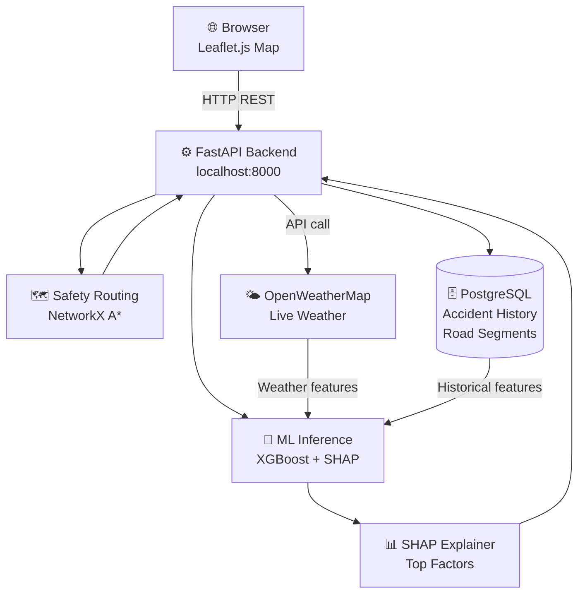
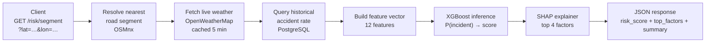
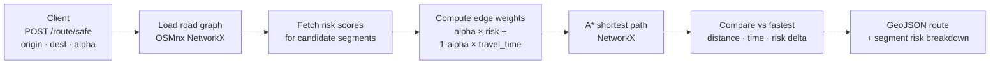
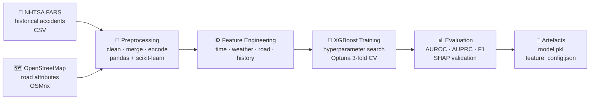
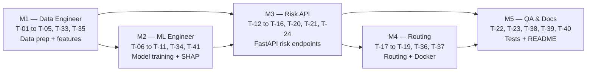

# STRIVE — Product Requirements Document

**Document version:** 2.2.0
**Status:** Draft
**Author:** Karri Chanikya Sri Hari Narayana Dattu
**Last updated:** 2026-04-13

---

## Table of Contents

1. [Executive Summary](#1-executive-summary)
2. [Problem Statement & Motivation](#2-problem-statement--motivation)
3. [Goals & Non-Goals](#3-goals--non-goals)
4. [System Architecture](#4-system-architecture)
5. [Data Requirements](#5-data-requirements)
6. [Machine Learning Requirements](#6-machine-learning-requirements)
7. [API Requirements](#7-api-requirements)
8. [Frontend Requirements](#8-frontend-requirements)
9. [Non-Functional Requirements](#9-non-functional-requirements)
10. [Risks & Mitigations](#10-risks--mitigations)
11. [Evaluation & Success Criteria](#11-evaluation--success-criteria)
12. [Development Task Breakdown](#12-development-task-breakdown)
13. [Glossary](#13-glossary)
14. [Revision History](#14-revision-history)

---

## 1. Executive Summary

STRIVE (Spatio-Temporal Risk Intelligence and Vehicular Safety Engine) is a research prototype that predicts road-segment accident risk in real time using weather, time-of-day, and road attributes. It provides explainable AI insights through SHAP factor attributions and supports safety-aware route recommendations via a tunable cost function.

The system is designed for a **small team** (3–5 students) working in a **university research context**. It uses standard, well-documented technologies: a Python FastAPI backend, an XGBoost ML model, a PostgreSQL database, and a Leaflet.js map frontend. There are no distributed systems, message brokers, or proprietary infrastructure requirements.

**Core value:**
1. **Accuracy** — XGBoost model trained on historical crash data, capturing spatial, temporal, and environmental risk factors.
2. **Explainability** — every prediction includes SHAP attributions so users can understand why a route is risky.
3. **Simplicity** — the full stack runs on a single machine with `docker compose up`.

---

## 2. Problem Statement & Motivation

### 2.1 The Safety Gap in Navigation

Modern navigation systems optimise for travel time and distance. Road safety is a secondary concern addressed only through reactive incident overlays. There is no widely available system that:

- Proactively scores the safety of every road segment in real time
- Explains why a segment is risky in human-readable terms
- Offers safety-optimised routing with a transparent risk/time tradeoff

### 2.2 Scale of the Problem

- Road crashes cause **1.35 million deaths** per year globally (WHO, 2023)
- The majority involve a combination of speed, weather, and road conditions — all **quantifiable**

### 2.3 Research Opportunity

Open datasets (NHTSA FARS, OpenStreetMap) and free weather APIs (OpenWeatherMap) make it feasible to build a meaningful research prototype without expensive infrastructure. This project demonstrates that explainable, safety-aware routing is achievable with lightweight tools.

---

## 3. Goals & Non-Goals

### 3.1 Goals

| ID | Goal |
|---|---|
| G-01 | Produce a risk score [0–100] per road segment using weather + time + road attributes |
| G-02 | Explain every risk score with SHAP feature attributions and a plain-English summary |
| G-03 | Return a safety-optimised route between two coordinates using A\* with risk-weighted edges |
| G-04 | Achieve AUROC ≥ 0.82 on the held-out test set |
| G-05 | Display a risk heatmap and route overlay on an interactive Leaflet.js map |
| G-06 | Set up the full stack with a single `docker compose up` command |
| G-07 | Expose results via a documented REST API with OpenAPI/Swagger UI |

### 3.2 Non-Goals

| ID | Non-Goal | Rationale |
|---|---|---|
| NG-01 | Real-time streaming / event-driven pipeline (Kafka, Faust) | Out of scope for a research prototype |
| NG-02 | Distributed caching (Redis Cluster) | In-process caching is sufficient for research scale |
| NG-03 | Kubernetes / cloud deployment | Docker Compose covers the team's needs |
| NG-04 | Graph Neural Networks / deep learning | XGBoost provides strong tabular performance without GPU requirements |
| NG-05 | Multi-city scale (≥ 50 cities simultaneously) | One or two target cities for the research demo |
| NG-06 | Commercial API tiers, rate limiting, billing | Research prototype only |
| NG-07 | Mobile native apps | Web frontend is sufficient |

---

## 4. System Architecture

### 4.1 Overview

STRIVE is a three-tier web application:

- **Frontend** — a Leaflet.js single-page app served by FastAPI's static file handler
- **Backend** — a single FastAPI process handling ML inference, routing, and database access
- **Database** — a single PostgreSQL instance storing historical accident data and road-segment metadata



### 4.2 Component Responsibilities

| Component | Technology | Responsibility |
|---|---|---|
| **Map Frontend** | Leaflet.js + vanilla JS | Render risk heatmap, accept route requests, display SHAP explanations |
| **REST API** | FastAPI (Python) | Route HTTP requests; orchestrate inference, routing, and DB access |
| **ML Model** | XGBoost + scikit-learn | Predict accident probability from feature vector |
| **Explainer** | SHAP | Compute per-feature contributions for each prediction |
| **Router** | NetworkX + OSMnx | Build road graph; compute A\* path with risk-weighted edges |
| **Database** | PostgreSQL 15 | Store historical accident records and road-segment features |
| **Weather Client** | OpenWeatherMap API | Fetch live precipitation, visibility, temperature, wind |

### 4.3 Data Flow

#### Risk Scoring Request



#### Safety Routing Request



#### Model Training Pipeline



---

## 5. Data Requirements

### 5.1 Data Sources

| Source | Data | Format | Access |
|---|---|---|---|
| NHTSA FARS | US fatal crash records (annual) | CSV | Public domain — [NHTSA portal](https://www.nhtsa.gov/research-data/fatality-analysis-reporting-system-fars) |
| OpenStreetMap | Road geometry, speed limits, road class | OSMnx Python library | Free — ODbL licence |
| OpenWeatherMap | Live weather at coordinates | REST JSON | Free tier (1,000 calls/day) |

### 5.2 Minimum Data Requirements

| Requirement | Detail |
|---|---|
| Historical accident records | ≥ 2 years of NHTSA FARS data for target city/region |
| Road network | OSM data for target city, loaded via OSMnx |
| Weather | OpenWeatherMap free-tier API key |

### 5.3 Feature Schema

| Feature | Type | Source | Notes |
|---|---|---|---|
| `hour_of_day` | int [0–23] | Timestamp | UTC hour |
| `day_of_week` | int [0–6] | Timestamp | 0 = Monday |
| `month` | int [1–12] | Timestamp | Calendar month |
| `precipitation_mm` | float | OpenWeatherMap | Rain in last 1 h |
| `visibility_km` | float | OpenWeatherMap | Visibility |
| `wind_speed_ms` | float | OpenWeatherMap | Wind speed |
| `temperature_c` | float | OpenWeatherMap | Air temperature |
| `road_class` | int | OSM | 1=motorway … 5=residential |
| `speed_limit_kmh` | int | OSM | Posted limit |
| `historical_accident_rate` | float | NHTSA FARS | Incidents / km / year for this segment |
| `night_indicator` | bool | Derived | Civil twilight check |
| `rain_on_congestion` | float | Derived | `precipitation_mm × (1 − speed_ratio)` |

### 5.4 Data Privacy

- No personally identifiable information (PII) is collected or stored
- Historical data from NHTSA FARS is already anonymised at the record level
- Live weather data is fetched at coordinate level, not tied to any user

---

## 6. Machine Learning Requirements

### 6.1 Problem Formulation

| Aspect | Detail |
|---|---|
| **Task** | Binary classification — predict whether a road segment will experience an incident |
| **Label** | Incident occurred at this segment in this time window (binary, from FARS) |
| **Output** | `P(incident) ∈ [0, 1]` scaled to risk score [0–100] |
| **Positive rate** | ~2–5 % (segment-hour pairs with an incident) |

Risk score formula:

```
risk_score = round(100 × P(incident))
```

Risk levels:

| Level | Score Range |
|---|---|
| LOW | 0–25 |
| MODERATE | 26–50 |
| HIGH | 51–75 |
| CRITICAL | 76–100 |

### 6.2 Model Requirements

| Requirement | Specification |
|---|---|
| Algorithm | XGBoost (gradient-boosted decision trees) |
| Explainability | SHAP TreeExplainer — compatible with XGBoost natively |
| Hardware | CPU-only; must train in ≤ 30 min on a laptop |
| Inference latency | ≤ 50 ms per segment on CPU |
| Serialisation | `joblib` or `pickle` — `model.pkl` |

### 6.3 Training Requirements

| Requirement | Specification |
|---|---|
| Train / val / test split | 70 / 15 / 15 — chronological split (no leakage) |
| Class imbalance handling | `scale_pos_weight` parameter in XGBoost |
| Hyperparameter search | Optuna (50 trials, 3-fold time-series cross-validation) |
| Experiment tracking | MLflow (local file store — no separate server needed) |

### 6.4 Evaluation Requirements

| Metric | Minimum Threshold | Target |
|---|---|---|
| AUROC | 0.78 | 0.85 |
| AUPRC | 0.30 | 0.40 |
| F1 @ optimal threshold | 0.50 | 0.60 |
| Expected Calibration Error | ≤ 0.10 | ≤ 0.06 |

### 6.5 Explainability Requirements

| Requirement | Detail |
|---|---|
| Method | SHAP TreeExplainer |
| Output | Top 4 features with SHAP values and human-readable labels |
| Natural language summary | Template-based sentence describing the top 2 risk factors |
| Latency | ≤ 100 ms per segment (SHAP computation on CPU) |

---

## 7. API Requirements

### 7.1 Design Principles

- RESTful design, OpenAPI 3.1 spec auto-generated by FastAPI
- All responses in JSON; GeoJSON for geographic data
- No authentication required for the research prototype
- Swagger UI available at `/docs`

### 7.2 Required Endpoints

| Method | Path | Description |
|---|---|---|
| `GET` | `/v1/risk/segment` | Risk score + SHAP explanation for a lat/lon point |
| `GET` | `/v1/risk/heatmap` | GeoJSON heatmap of risk scores within a bounding box |
| `POST` | `/v1/route/safe` | Safety-optimised route between two coordinates |
| `GET` | `/v1/explain/segment` | Full SHAP explanation for a lat/lon point |
| `GET` | `/health` | Health check |
| `GET` | `/docs` | Swagger UI |

### 7.3 Response Contracts

**GET /v1/risk/segment**
```json
{
  "segment_id": "way/123456789",
  "risk_score": 74,
  "risk_level": "HIGH",
  "updated_at": "2026-04-13T18:30:00Z",
  "top_factors": [
    { "feature": "precipitation_mm", "shap": 18.4, "label": "Heavy rain" },
    { "feature": "night_indicator",  "shap":  6.3, "label": "Night-time" }
  ],
  "summary": "HIGH RISK. Heavy rain on a historically dangerous segment at night."
}
```

**POST /v1/route/safe**
```json
{
  "route_id": "rte_abc123",
  "geometry": { "type": "LineString", "coordinates": [[...]] },
  "distance_km": 8.4,
  "duration_min": 18,
  "overall_risk_score": 31,
  "vs_fastest_route": {
    "extra_distance_km": 1.2,
    "extra_time_min": 3,
    "risk_reduction_pct": 38
  },
  "segments": [
    { "segment_id": "way/111", "risk_score": 18, "risk_level": "LOW", "distance_km": 1.1 }
  ]
}
```

---

## 8. Frontend Requirements

| Requirement | Detail |
|---|---|
| Technology | Leaflet.js + vanilla JavaScript (no framework required) |
| Map tiles | OpenStreetMap tile layer (free) |
| Risk heatmap | GeoJSON overlay with colour scale: green → yellow → red |
| Route display | Polyline overlay with per-segment risk colour coding |
| SHAP panel | Side panel showing top factors for a clicked segment |
| Route input | Text boxes for origin and destination; slider for α |
| Responsiveness | Functional on desktop browsers; mobile is a stretch goal |

---

## 9. Non-Functional Requirements

### 9.1 Performance (Research Scale)

| Requirement | Target |
|---|---|
| Risk scoring latency | ≤ 500 ms end-to-end (including weather API call) |
| Route computation | ≤ 2 s for typical city routes |
| Concurrent users | ≥ 5 simultaneous users (research demo) |
| Weather cache TTL | 5 min (in-process dictionary) |

### 9.2 Reliability

| Requirement | Target |
|---|---|
| Weather API outage | Fall back to last cached values; return score with stale-data flag |
| Database unavailable | Return HTTP 503 with a clear error message |
| Model file missing | Return HTTP 500; log the error |

### 9.3 Maintainability

| Requirement | Detail |
|---|---|
| Code style | Ruff linter; Black formatter |
| Type hints | mypy for all API and ML code |
| Test coverage | ≥ 70 % line coverage (pytest) |
| Documentation | Docstrings for all public functions; README kept up to date |

### 9.4 Deployment

| Requirement | Detail |
|---|---|
| Local setup | `docker compose up` starts API + database |
| Dependency management | `requirements.txt` (pip) or `pyproject.toml` (Poetry) |
| Configuration | Environment variables via `.env` file |
| Database migrations | Alembic for schema management |

---

## 10. Risks & Mitigations

| ID | Risk | Likelihood | Impact | Mitigation |
|---|---|---|---|---|
| R-01 | OpenWeatherMap API rate limit hit | Low | Medium | Cache responses 5 min; use free tier wisely |
| R-02 | NHTSA FARS data too sparse for target city | Medium | High | Use a high-accident-density city (e.g. Los Angeles, Chicago); augment with state data |
| R-03 | Model AUROC below target | Medium | Medium | Add features, tune hyperparameters, expand training data |
| R-04 | OSM road matching errors | Low | Low | Use OSMnx nearest-edge snapping with ≤ 50 m threshold |
| R-05 | Legal: routing leads to an accident | Low | High | Prominently label STRIVE as advisory-only research software; not for safety-critical use |
| R-06 | Team capacity / time | Medium | High | Prioritise core ML + API (Phases 1–2) before frontend polish |

---

## 11. Evaluation & Success Criteria

### 11.1 Research Demo Criteria

All of the following should be met for a successful research demonstration:

| Criterion | Target |
|---|---|
| Model AUROC | ≥ 0.82 on held-out test set |
| Risk scoring latency | ≤ 500 ms per request |
| Route computation | ≤ 2 s for a typical city route |
| SHAP top factors | Align with domain knowledge (rain, night, accident history) |
| Safety routing benefit | Safe route demonstrates ≥ 20 % risk reduction vs fastest at α=0.6 |
| Frontend | Map renders heatmap; route is displayed; SHAP panel is functional |

### 11.2 Acceptance Scenarios

| Scenario | Input | Expected Output |
|---|---|---|
| Wet night segment | rain=12 mm, night=True, high historical rate | risk_score ≥ 65 |
| Clear day segment | rain=0, visibility=10 km, night=False, low history | risk_score ≤ 25 |
| Safety routing | α=0.8, dangerous shortcut available | Shortcut NOT selected |
| SHAP alignment | High rain + high history segment | precipitation + historical_rate in top 2 SHAP factors |

---

## 12. Development Task Breakdown

> **Note on Frontend:** The Leaflet.js interactive map frontend (T-25 to T-32) is maintained **separately by the project lead** and is not part of any team member's assessed tasks. See [Section 8](#8-frontend-requirements) for the frontend specification. Individual task files are located in the [`tasks/`](../tasks/) directory.

The 33 backend and data-science tasks are divided across **5 team members** by role. Each member owns a coherent domain so that work is parallel and dependencies are clear.

### 12.1 Team Roles & Task Summary

| Member | Role | Tasks | Count |
|---|---|---|---|
| **M1** | Data Engineer | T-01, T-02, T-03, T-04, T-05, T-33, T-35 | 7 |
| **M2** | ML Engineer | T-06, T-07, T-08, T-09, T-10, T-11, T-34, T-41 | 8 |
| **M3** | Backend Engineer — Risk API | T-12, T-13, T-14, T-15, T-16, T-20, T-21, T-24 | 8 |
| **M4** | Backend Engineer — Routing | T-17, T-18, T-19, T-36, T-37 | 5 |
| **M5** | QA Engineer & Technical Writer | T-22, T-23, T-38, T-39, T-40 | 5 |

### 12.2 Dependency Flow



---

### 12.3 M1 — Data Engineer

**Responsibility:** Collect, clean, and prepare all training data. Build the feature engineering pipeline shared by M2 (training) and M3 (inference).

📄 Full task details: [`tasks/M1-data-engineer.md`](../tasks/M1-data-engineer.md)

| Task | Description | Phase |
|---|---|---|
| T-01 | Download NHTSA FARS CSV data for target city (2+ years) | 1 |
| T-02 | Download OSM road network via OSMnx for target city | 1 |
| T-03 | Match FARS accident records to nearest OSM road segment (≤ 50 m snap) | 1 |
| T-04 | Compute `historical_accident_rate` per road segment (incidents / km / year) | 1 |
| T-05 | Implement `app/ml/features.py` — full feature engineering pipeline | 1 |
| T-33 | Write `scripts/download_data.py` — automated NHTSA + OSM data fetch | 4 |
| T-35 | Write `scripts/seed_data.py` — populate PostgreSQL `road_segments` and `accidents` tables | 4 |

**Deliverables:** `data/processed/features.parquet`, `app/ml/features.py`, `scripts/download_data.py`, `scripts/seed_data.py`

---

### 12.4 M2 — ML Engineer

**Responsibility:** Train and evaluate the XGBoost risk model. Validate SHAP explainability. Produce the saved model artefact consumed by M3.

📄 Full task details: [`tasks/M2-ml-engineer.md`](../tasks/M2-ml-engineer.md)

| Task | Description | Phase |
|---|---|---|
| T-06 | Create chronological train / val / test split (70 / 15 / 15) — no temporal leakage | 1 |
| T-07 | Train XGBoost baseline model with default hyperparameters; log to MLflow | 1 |
| T-08 | Run Optuna hyperparameter search (50 trials, 3-fold time-series CV) | 1 |
| T-09 | Evaluate final model: AUROC, AUPRC, F1 @ optimal threshold, ECE | 1 |
| T-10 | Validate SHAP explanations — confirm top factors match domain expectations | 1 |
| T-11 | Save model artefact to `models/model.pkl` and feature config to `models/feature_config.json` | 1 |
| T-34 | Write `scripts/train_model.py` — end-to-end training pipeline with MLflow logging | 4 |
| T-41 | Prepare research report / slides: model evaluation, SHAP analysis, routing quality | 4 |

**Evaluation targets:** AUROC ≥ 0.82, AUPRC ≥ 0.35, F1 ≥ 0.55, ECE ≤ 0.08

**Deliverables:** `models/model.pkl`, `models/feature_config.json`, `scripts/train_model.py`, evaluation notebook, research slides

---

### 12.5 M3 — Backend Engineer (Risk API)

**Responsibility:** Set up the FastAPI project, database schema, and all risk-scoring endpoints. Integrates M1's feature pipeline and M2's model.

📄 Full task details: [`tasks/M3-backend-risk-api.md`](../tasks/M3-backend-risk-api.md)

| Task | Description | Phase |
|---|---|---|
| T-12 | Initialise FastAPI project structure and `requirements.txt` | 2 |
| T-13 | Define PostgreSQL schema with Alembic migrations (`road_segments`, `accidents` tables) | 2 |
| T-14 | Implement `app/weather.py` — OpenWeatherMap client with 5-min in-process cache | 2 |
| T-15 | Implement `GET /v1/risk/segment` — full scoring pipeline (segment lookup → weather → features → XGBoost → SHAP) | 2 |
| T-16 | Implement `GET /v1/risk/heatmap` — GeoJSON FeatureCollection for a bounding box | 2 |
| T-20 | Implement `GET /v1/explain/segment` — full SHAP output for a lat/lon point | 2 |
| T-21 | Add `GET /health` endpoint | 2 |
| T-24 | Validate Swagger UI at `/docs` — confirm all endpoints are documented with examples | 2 |

**Deliverables:** `app/main.py`, `app/routers/risk.py`, `app/routers/explain.py`, `app/weather.py`, `app/db/models.py`, Alembic migrations

---

### 12.6 M4 — Backend Engineer (Routing)

**Responsibility:** Build the safety-aware A\* routing engine, expose the routing endpoint, and own the Docker setup.

📄 Full task details: [`tasks/M4-backend-routing.md`](../tasks/M4-backend-routing.md)

| Task | Description | Phase |
|---|---|---|
| T-17 | Implement `app/routing/graph.py` — OSMnx road graph loading and in-memory caching | 2 |
| T-18 | Implement `app/routing/astar.py` — A\* with edge cost `α × risk + (1−α) × travel_time` | 2 |
| T-19 | Implement `POST /v1/route/safe` — routing endpoint with vs-fastest comparison | 2 |
| T-36 | Write `Dockerfile` and `docker-compose.yml` (API + PostgreSQL services) | 4 |
| T-37 | Write `.env.example` with all required environment variables documented | 4 |

**Deliverables:** `app/routing/graph.py`, `app/routing/astar.py`, `app/routers/route.py`, `Dockerfile`, `docker-compose.yml`, `.env.example`

---

### 12.7 M5 — QA Engineer & Technical Writer

**Responsibility:** Ensure correctness and performance of the full system through unit tests, integration tests, end-to-end validation, and the final README.

📄 Full task details: [`tasks/M5-testing-docs.md`](../tasks/M5-testing-docs.md)

| Task | Description | Phase |
|---|---|---|
| T-22 | Write unit tests for feature engineering, model inference, and routing (≥ 70 % coverage) | 2 |
| T-23 | Write integration tests for all API endpoints (pytest + httpx) | 2 |
| T-38 | End-to-end demo validation: API call → risk score → SHAP output → routed response | 4 |
| T-39 | Performance check: confirm risk scoring ≤ 500 ms, routing ≤ 2 s | 4 |
| T-40 | Update `README.md` with final setup instructions and model evaluation results | 4 |

**Deliverables:** `tests/unit/`, `tests/integration/`, `tests/e2e/`, `reports/performance.md`, updated `README.md`

---

### 12.8 Phase View (with member labels)

Tasks are listed in execution order. Each task is labelled with its owning member.

#### Phase 1 — Data & Model

- [ ] **T-01** `[M1]` Download NHTSA FARS data for target city (2+ years)
- [ ] **T-02** `[M1]` Download OSM road network via OSMnx for target city
- [ ] **T-03** `[M1]` Match FARS accident records to nearest OSM road segment
- [ ] **T-04** `[M1]` Compute `historical_accident_rate` per road segment
- [ ] **T-05** `[M1]` Implement feature engineering pipeline (`app/ml/features.py`)
- [ ] **T-06** `[M2]` Create chronological train / val / test split (70/15/15)
- [ ] **T-07** `[M2]` Train XGBoost baseline model with default hyperparameters
- [ ] **T-08** `[M2]` Run Optuna hyperparameter search (50 trials, 3-fold time-series CV)
- [ ] **T-09** `[M2]` Evaluate final model: AUROC, AUPRC, F1, ECE
- [ ] **T-10** `[M2]` Validate SHAP explanations — confirm top factors match domain knowledge
- [ ] **T-11** `[M2]` Save `models/model.pkl` and `models/feature_config.json`

#### Phase 2 — Backend API

- [ ] **T-12** `[M3]` Initialise FastAPI project structure and `requirements.txt`
- [ ] **T-13** `[M3]` Define PostgreSQL schema with Alembic migrations
- [ ] **T-14** `[M3]` Implement weather client with 5-min in-process cache
- [ ] **T-15** `[M3]` Implement `GET /v1/risk/segment` endpoint
- [ ] **T-16** `[M3]` Implement `GET /v1/risk/heatmap` endpoint (GeoJSON output)
- [ ] **T-17** `[M4]` Implement road graph loading and caching (`app/routing/graph.py`)
- [ ] **T-18** `[M4]` Implement A\* routing with risk-weighted edges (`app/routing/astar.py`)
- [ ] **T-19** `[M4]` Implement `POST /v1/route/safe` endpoint
- [ ] **T-20** `[M3]` Implement `GET /v1/explain/segment` endpoint (full SHAP output)
- [ ] **T-21** `[M3]` Add `GET /health` endpoint
- [ ] **T-22** `[M5]` Write unit tests for feature engineering, inference, and routing (≥ 70 % coverage)
- [ ] **T-23** `[M5]` Write integration tests for all API endpoints (pytest + httpx)
- [ ] **T-24** `[M3]` Validate Swagger UI at `/docs`

#### Phase 3 — Frontend *(maintained separately by project lead)*

> The following tasks are **not assigned to any team member**. The Leaflet.js frontend is developed independently and integrated via FastAPI's static file handler. See `frontend/` directory and [Section 8](#8-frontend-requirements) for specification.

- T-25 Set up Leaflet.js single-page app
- T-26 Render OSM base tile layer
- T-27 Implement risk heatmap overlay with colour scale
- T-28 Implement SHAP panel for clicked road segment
- T-29 Implement route input form (origin, destination, α slider)
- T-30 Render safe route polyline with per-segment risk colouring
- T-31 Display route summary card (distance, time, risk, vs-fastest)
- T-32 Serve frontend as FastAPI static files at `/map`

#### Phase 4 — Integration & Polish

- [ ] **T-33** `[M1]` Write `scripts/download_data.py` — automated NHTSA + OSM data fetch
- [ ] **T-34** `[M2]` Write `scripts/train_model.py` — end-to-end training pipeline with logging
- [ ] **T-35** `[M1]` Write `scripts/seed_data.py` — populate PostgreSQL with sample data
- [ ] **T-36** `[M4]` Write `Dockerfile` and `docker-compose.yml`
- [ ] **T-37** `[M4]` Write `.env.example` with all required variables documented
- [ ] **T-38** `[M5]` End-to-end demo validation: API call → risk score → SHAP output → routed response
- [ ] **T-39** `[M5]` Performance check: risk scoring ≤ 500 ms, routing ≤ 2 s
- [ ] **T-40** `[M5]` Update `README.md` with final setup instructions and evaluation results
- [ ] **T-41** `[M2]` Prepare research report / slides with model evaluation and SHAP analysis


---

## 13. Glossary

| Term | Definition |
|---|---|
| **AUROC** | Area Under the Receiver Operating Characteristic curve; measures classifier discrimination |
| **AUPRC** | Area Under the Precision-Recall Curve; better metric for imbalanced datasets |
| **ECE** | Expected Calibration Error; measures how well predicted probabilities match true frequencies |
| **OSM** | OpenStreetMap — open road network data |
| **OSMnx** | Python library for downloading and processing OSM road networks |
| **SHAP** | SHapley Additive exPlanations — game-theoretic feature attribution |
| **XGBoost** | Extreme Gradient Boosting — gradient-boosted decision tree library |
| **A\*** | A-star search — graph shortest-path algorithm used for routing |
| **NetworkX** | Python graph library used for road network traversal |
| **α (alpha)** | Safety weight parameter ∈ [0, 1]; controls trade-off between safety and speed |
| **PII** | Personally Identifiable Information |
| **NHTSA FARS** | National Highway Traffic Safety Administration Fatality Analysis Reporting System |

---

## 14. Revision History

| Version | Date | Author | Changes |
|---|---|---|---|
| 1.0.0 | 2026-04-13 | Karri Chanikya Sri Hari Narayana Dattu | Initial draft |
| 2.0.0 | 2026-04-13 | Karri Chanikya Sri Hari Narayana Dattu | Simplified to research prototype: replaced Kafka/Faust/GNN/Redis with XGBoost/FastAPI/PostgreSQL; added Mermaid flow diagrams; added full task breakdown |
| 2.1.0 | 2026-04-13 | Karri Chanikya Sri Hari Narayana Dattu | Added 5-member task assignment: M1 Data Engineer, M2 ML Engineer, M3 Risk API, M4 Routing & DevOps, M5 Frontend |
| 2.2.0 | 2026-04-13 | Karri Chanikya Sri Hari Narayana Dattu | Moved frontend to project-lead scope (not part of assessed tasks); redistributed 33 tasks across 5 members (M5 becomes QA & Docs); created individual task files in `tasks/` folder |
